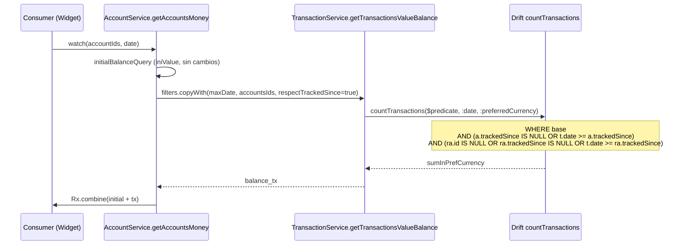
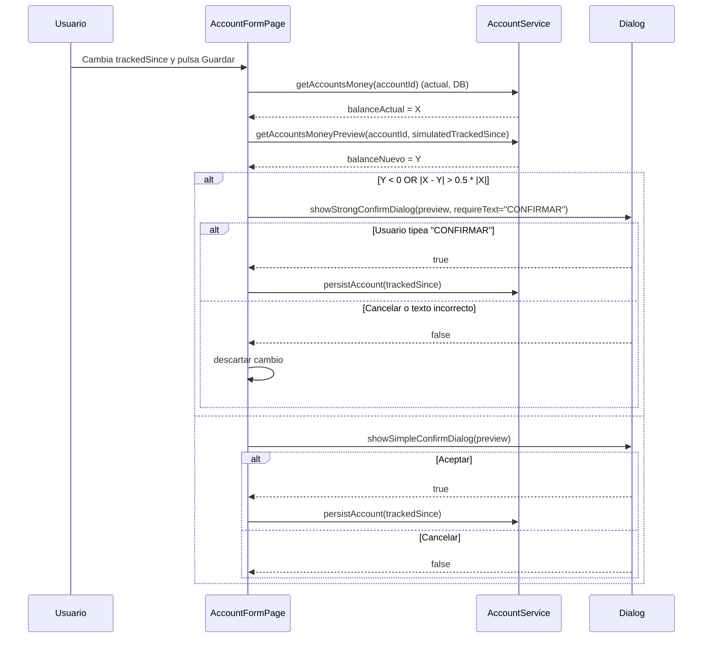

# Design: account-pre-tracking-period

## Enfoque técnico

Añadir una columna `trackedSince DATETIME` nullable a `accounts` y modificar un único predicado SQL en la query Drift `countTransactions` para excluir transacciones pre-tracking del balance sin crear queries paralelas. La query ya hace `INNER JOIN accounts a` y `LEFT JOIN accounts ra` (receiving account): el filtro se inyecta ahí aprovechando esos joins existentes. El cálculo de `initialBalance` en `getAccountsMoney` no cambia (el `iniValue` siempre cuenta como saldo de apertura).

---

## Decisiones de arquitectura

### 1. Filtro en `$predicate` de `countTransactions`, no query nueva

| Opción | Tradeoff | Decisión |
|--------|----------|----------|
| Query nueva `countTransactionsRespectTracked` | Duplica 60+ líneas de SQL, desincroniza con multi-currency logic | Rechazada |
| Flag booleano `respectTrackedSince` añadido al builder de predicados Dart | Un solo punto de cambio, reutiliza multi-currency + transfers | **Elegida** |
| Filtro Dart-side post-query | Trae todas las rows, rompe streams reactivos de Drift | Rechazada |

**Rationale**: el `$predicate` de Drift es un `Expression<bool>` compuesto en Dart. Los consumidores (balance, stats, debts) ya pasan su `TransactionFilterSet`. Añadimos un flag `respectTrackedSince` en el filter set que, cuando es `true`, suma dos predicados a la composición: `a.trackedSince IS NULL OR t.date >= a.trackedSince` y el equivalente para `ra` (receiving).

### 2. Simetría de transfers en el mismo predicado

Las 3 queries internas de `_countTransactions` usan el mismo SQL base. Para transfers (`type = 'T'`), el predicado añadido evalúa **ambas** cuentas:

```
AND (a.trackedSince IS NULL OR t.date >= a.trackedSince)
AND (ra.id IS NULL OR ra.trackedSince IS NULL OR t.date >= ra.trackedSince)
```

El caso "uno NULL, otro con fecha" funciona naturalmente: NULL cortocircuita el OR. El `ra.id IS NULL` protege a transacciones no-transfer donde el LEFT JOIN devuelve NULL.

### 3. Cálculo de balance simulado en form sin persistir

El diálogo de edición retroactiva llama a `getAccountsMoney()` dos veces: una con el `trackedSince` actual (en DB) y otra con el nuevo en memoria, usando un método `getAccountsMoneyPreview(accountId, simulatedTrackedSince)` en `AccountService` que acepta override. Evita código duplicado de cálculo.

### 4. Badge en `TransactionListTile`

El tile ya recibe `MoneyTransaction transaction`. El modelo `MoneyTransaction` embebe `Account account` completo (ver `transaction.dart`). El badge es condicional: `account.trackedSince != null && transaction.date.isBefore(account.trackedSince!)`. Cero cambios de plumbing.

---

## Flujo de cálculo de balance



Stats widgets pasan `respectTrackedSince=false` → predicado extra omitido → comportamiento idéntico al actual.

---

## Flujo del diálogo de edición retroactiva



---

## Cambios por archivo

| Archivo | Acción | Qué cambia |
|---------|--------|-----------|
| `assets/sql/migrations/v24.sql` | Crear | `ALTER TABLE accounts ADD COLUMN trackedSince DATETIME;` |
| `lib/core/database/sql/initial/tables.drift:52-83` | Modificar | Añadir `trackedSince DATETIME` a definición |
| `lib/core/database/app_db.dart:115` | Modificar | `schemaVersion => 24` |
| `lib/core/models/account/account.dart:52-128` | Modificar | Exponer `trackedSince` + helper `isTrackingHistorical(txDate)` |
| `lib/core/database/services/account/account_service.dart:135-212` | Modificar | `getAccountsMoney` pasa `respectTrackedSince=true` al filter set; nuevo `getAccountsMoneyPreview(...)` |
| `lib/core/presentation/widgets/transaction_filter/transaction_filter_set.dart` | Modificar | Añadir flag `respectTrackedSince` al filter set |
| `lib/core/database/services/transaction/transaction_service.dart` | Modificar | Builder de predicado incluye condición `trackedSince` cuando flag está activo |
| `lib/app/accounts/account_form.dart:38-493` | Modificar | DateTimeFormField + lógica de confirmación retroactiva |
| `lib/app/transactions/widgets/transaction_list_tile.dart:154-215` | Modificar | Badge `Icons.history` condicional |
| `lib/i18n/json/es.json` | Modificar | Claves nuevas (abajo) |
| `lib/i18n/json/en.json` | Modificar | Traducción equivalente |

---

## Contrato SQL añadido

Pseudocódigo del predicado extra que se compondrá en Dart:

```sql
-- Añadido al $predicate base cuando respectTrackedSince = true
AND (a.trackedSince IS NULL OR t.date >= a.trackedSince)
AND (ra.id IS NULL OR ra.trackedSince IS NULL OR t.date >= ra.trackedSince)
```

**Performance**: el JOIN con `accounts a` y `ra` ya existe. Se añade lectura de la columna `trackedSince` (zero-cost en SQLite al ser parte de la misma row). Índice `transactions.accountID` ya existe implícito por la FK. Para cuentas con >10k transacciones se validará con `EXPLAIN QUERY PLAN` que use el índice.

---

## Migración Drift v24

**Archivo**: `assets/sql/migrations/v24.sql`

```sql
ALTER TABLE accounts ADD COLUMN trackedSince DATETIME;
```

**Bump**: `app_db.dart` → `schemaVersion => 24`.

**Regeneración**: tras modificar `tables.drift`, correr `dart run build_runner build --delete-conflicting-outputs`.

**Rollback**:
- Lógica: revertir commits de `account_service.dart`, `transaction_filter_set.dart`, `account_form.dart`, `transaction_list_tile.dart`, i18n.
- Datos: `v25.sql` con `ALTER TABLE accounts DROP COLUMN trackedSince` (SQLite ≥3.35). Alternativa segura: dejar la columna huérfana (nullable → sin impacto funcional si nadie la lee).

---

## Claves i18n

```json
// es.json
"ACCOUNT": {
  "FORM": {
    "tracked-since": "Rastrear desde",
    "tracked-since.hint": "Opcional",
    "tracked-since.info": "Las transacciones anteriores a esta fecha aparecerán en el historial pero no afectarán el balance"
  },
  "BADGE": {
    "pre-tracking": "Histórico",
    "pre-tracking.tooltip": "No afecta el balance actual"
  },
  "RETROACTIVE": {
    "preview-title": "Impacto en el balance",
    "preview-message": "Balance actual: {current} → Balance nuevo: {simulated}",
    "strong-confirm-hint": "Escribe CONFIRMAR para continuar"
  }
}
```

**Comando post-edición**: `dart run slang`.

EN equivalente: `Track since`, `Optional`, `Historical`, `Does not affect current balance`, etc.

---

## Riesgos y mitigaciones

| Riesgo | Mitigación | Criterio done |
|--------|-----------|---------------|
| Desbalance por transfer asimétrica | Predicado simétrico en receiving + origin | Unit test cubre caso A.trackedSince != NULL, B.trackedSince = NULL, transfer pre-tracking |
| Edición retroactiva sorpresiva | Diálogo preview + CONFIRMAR si negativo/diff >50% | Widget test del form simula 3 escenarios |
| JOIN extra penaliza queries | El JOIN ya existe; no se añade tabla nueva | EXPLAIN QUERY PLAN del balance muestra uso de índice |
| `ALTER TABLE ADD COLUMN` en SQLite viejo | SQLite bundle de sqlite3 flutter ≥3.35 | Confirmado al bumpear versión de package |
| Firebase sync hacia versiones viejas | Out of scope de este change | Aceptado |
| Retrocompatibilidad tras migrar | Default NULL = comportamiento actual | Integration test compara balance antes/después de migrar |

---

## Plan de testing

| Capa | Qué probar | Enfoque |
|------|-----------|---------|
| Unit (AccountService) | getAccountsMoney con trackedSince NULL, con txs anteriores, sin txs anteriores | In-memory Drift DB, fixtures manuales |
| Unit (transfer symmetry) | Transfer cruzando frontera de A (B NULL) → ambas patas ignoradas | In-memory Drift DB |
| Integration (migration) | DB v23 poblada → migrar → balance idéntico | Test de migración Drift |
| Widget (badge) | TransactionListTile con tx.date < account.trackedSince | Find `Icons.history` en render |
| Manual (form) | Diff <50%, diff >50%, balance nuevo negativo | Checklist de QA en PR |

---

## Preguntas abiertas

- [ ] Umbral de diff (50%) — ¿configurable por usuario o hardcoded? **Recomendación**: hardcoded por ahora, revisar tras feedback real.
- [ ] `closingDate < trackedSince` — ¿validación en form (bloqueo) o solo warning? **Recomendación**: bloqueo (no tiene sentido semántico), resolver en apply.
