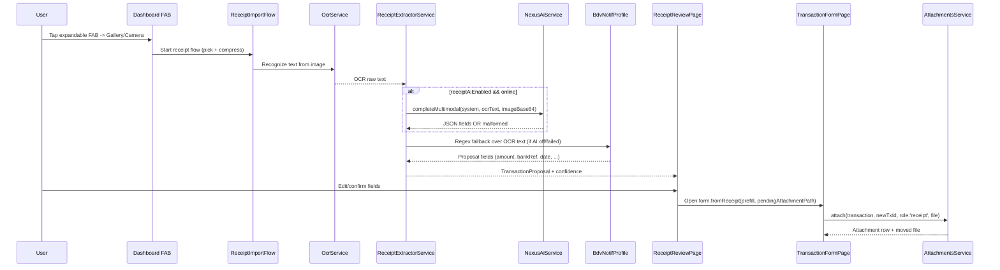
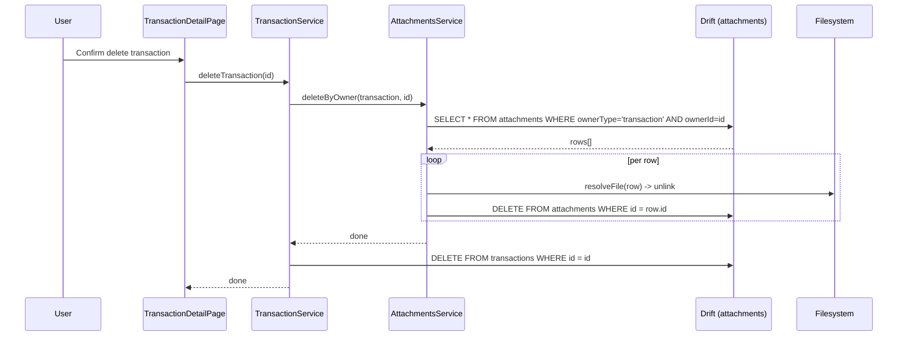
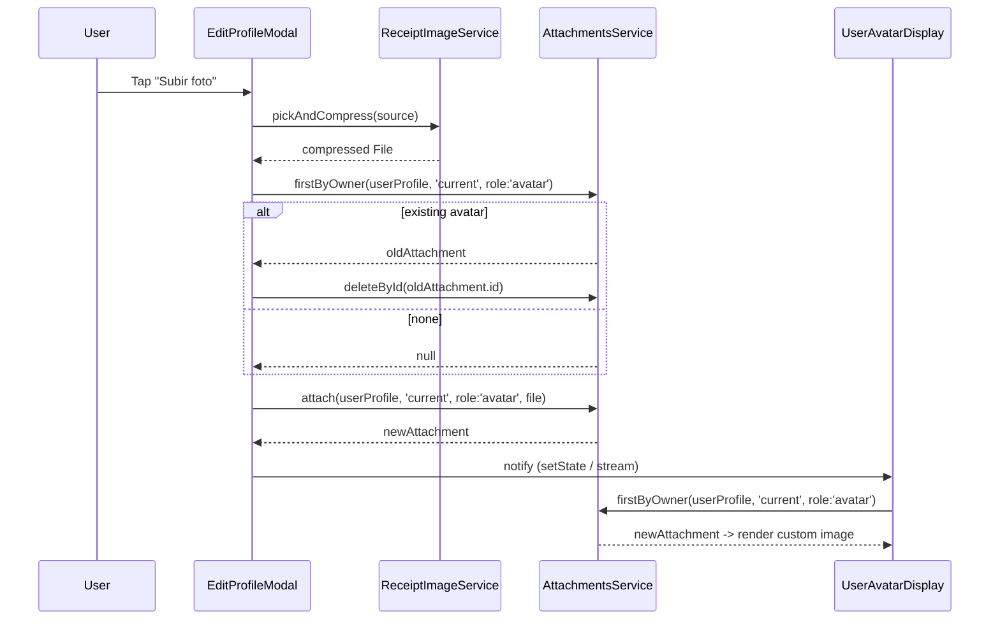

# Design: Attachments Subsystem + Receipt OCR Import

## Technical Approach

Additive, infra-first rollout in 6 tandas: (1) generic `attachments` persistence, (2) OCR + regex extractor MVP, (3) optional Nexus multimodal enrichment, (4) review-first import UX, (5) FAB + detail polish + orphan cleanup, (6) avatar reuse. The same polymorphic `attachments` primitive powers receipts, avatars, and future budget/account attachments, so the change delivers a platform capability — not just a feature. OCR+regex provides a deterministic baseline when AI is unavailable; the review page prevents silent writes under USD/VES ambiguity.

## Architecture Decisions

### Decision: Polymorphic `attachments` table (no hard FK)

**Choice**: Single `attachments(id, ownerType, ownerId, localPath, mimeType, sizeBytes, role, createdAt)` table with `ownerType` + `ownerId` (TEXT) discriminator. No foreign key to owner tables.

**Alternatives considered**: (a) per-entity path columns (`transactions.receiptPath`, `userProfiles.avatarPath`); (b) filesystem-only convention with no DB table.

**Rationale**: Hard FKs across heterogeneous owner tables would force cross-table drift migrations every time a new owner type is added and would make polymorphism impossible. Per-entity columns duplicate file-lifecycle logic across every owner and cap at one image per entity. A polymorphic table with a logical pointer decouples file lifecycle from owner schema entirely.

**Tradeoff accepted**: orphan rows are possible if an owner is deleted without calling `deleteByOwner`.

**Mitigation**: (a) every owner-deletion service (`TransactionService.deleteTransaction`, future `AccountService.delete`, etc.) MUST call `AttachmentsService.deleteByOwner(ownerType, ownerId)` in its delete path; (b) `purgeOrphans()` runs on app boot **only in debug mode** by default and is also exposed as a "Limpieza de adjuntos huérfanos" action under Settings → Storage, so the user (and debug builds) self-heal any orphans.

### Decision: Relative `localPath` rooted at `ApplicationDocumentsDirectory`

**Choice**: Files live under `<ApplicationDocumentsDirectory>/attachments/<ownerType>/<uuid>.<ext>`. `Attachment.localPath` stores the path **relative** to the documents dir (e.g., `attachments/transaction/abc123.jpg`). Absolute path is resolved at read time via `AttachmentsService.resolveFile(Attachment)`.

**Alternatives considered**: store absolute paths at write time.

**Rationale**: On iOS, the sandboxed documents-directory absolute path changes across app updates and device restores — absolute paths become stale and break every stored attachment. A relative path survives these moves; the absolute path is reconstructed on demand from the current `path_provider` docs dir.

**Compression**: images are compressed by the `image` package before `attach`: longest side 1600px, JPEG quality 82, target ~350 KB. Keeps DB row count and disk usage bounded without visibly degrading receipts.

### Decision: Extraction order OCR → AI (optional) → regex fallback

**Choice**: OCR always runs first; Nexus multimodal runs if `receiptAiEnabled` is on and succeeds; regex fallback runs whenever AI is off, times out, or returns malformed JSON.

**Alternatives considered**: AI-first with OCR as fallback; AI-only.

**Rationale**: OCR+regex gives a deterministic, offline-capable baseline. AI enriches the result when available but never blocks capture. Any AI failure (network, timeout, malformed JSON) falls through to regex without crashing the flow.

### Decision: Mandatory review page before transaction write

**Choice**: Extractor output always lands in `ReceiptReviewPage` for user confirmation; only then do we open `TransactionFormPage.fromReceipt(...)` and save.

**Rationale**: VES/USD currency detection, counterparty matching, and account inference are probabilistic. A single silent bad write in a finance app is worse than one extra confirm tap.

### Decision: Extend existing `NexusAiService` rather than fork

**Choice**: Add `completeMultimodal(...)` to `NexusAiService`; existing text-only `complete()` stays byte-compatible.

**Rationale**: credentials store, gateway routing (`api.ramsesdb.tech`), and settings scaffolding already exist. A fork would duplicate all of it.

## Data Flow

### Receipt import (happy path)



### Transaction delete cascade



### Avatar upload / replace



## File Changes

| File | Action | Description |
|---|---|---|
| `lib/core/database/sql/initial/tables.drift` | Modify | Add `attachments` table + `idx_attachments_owner` |
| `assets/sql/migrations/v23.sql` | Create | Additive migration: `CREATE TABLE attachments` + index |
| `lib/core/database/app_db.dart` | Modify | Bump schemaVersion 22 -> 23, register v23 migration |
| `lib/core/services/attachments/attachment_model.dart` | Create | `Attachment` + `AttachmentOwnerType` enum |
| `lib/core/services/attachments/attachments_service.dart` | Create | Full CRUD + file I/O + orphan purge + path resolution |
| `lib/core/services/receipt_ocr/receipt_image_service.dart` | Create | Pick (camera/gallery), compress (1600px, JPEG q82), temp save |
| `lib/core/services/receipt_ocr/ocr_service.dart` | Create | ML Kit Latin recognizer wrapper |
| `lib/core/services/receipt_ocr/receipt_extractor_service.dart` | Create | OCR -> AI -> regex orchestration, emits `TransactionProposal` |
| `lib/core/services/ai/nexus_ai_service.dart` | Modify | Add `completeMultimodal(...)` (text `complete()` unchanged) |
| `lib/core/models/auto_import/transaction_proposal.dart` | Modify | Add `CaptureChannel.receiptImage` enum case |
| `lib/app/transactions/receipt_import/receipt_import_flow.dart` | Create | Static entry from FAB: pick -> loader -> review |
| `lib/app/transactions/receipt_import/receipt_review_page.dart` | Create | Preview + editable fields + confidence badge |
| `lib/app/transactions/form/transaction_form.page.dart` | Modify | Add `.fromReceipt(...)` ctor with `pendingAttachmentPath` |
| `lib/app/home/widgets/new_transaction_fl_button.dart` | Modify | Swap to `ExpandableFab` (manual / gallery / camera) |
| `lib/app/common/widgets/attachment_viewer.dart` | Create | Reusable fullscreen pinch-zoom viewer + delete |
| `lib/app/common/widgets/user_avatar_display.dart` | Create | Custom-or-SVG avatar renderer |
| `lib/core/database/services/transaction/transaction_service.dart` | Modify | `deleteTransaction()` calls `deleteByOwner(transaction, id)` |
| `lib/app/settings/widgets/edit_profile_modal.dart` | Modify | "Subir foto" button above SVG grid |
| `lib/app/settings/pages/ai/ai_settings.page.dart` | Modify | Add `SettingKey.receiptAiEnabled` toggle |
| `lib/app/settings/pages/storage/*` | Modify | Expose "Limpieza de adjuntos huérfanos" action |
| `i18n/en.i18n.json`, `i18n/es.i18n.json` | Modify | Keys under `t.transaction.receipt_import.*`, `t.attachments.*`, `t.profile.*` |
| `pubspec.yaml` | Modify | Add `image_picker`, `google_mlkit_text_recognition`, `image`; activate `flutter_expandable_fab` |
| `android/app/src/main/AndroidManifest.xml` | Modify | `CAMERA` permission + non-required camera feature |
| `ios/Runner/Info.plist` | Modify | `NSCameraUsageDescription`, `NSPhotoLibraryUsageDescription` |

## Interfaces / Contracts

### `AttachmentsService`

```dart
enum AttachmentOwnerType { transaction, userProfile, account, budget }

class Attachment {
  final String id;
  final AttachmentOwnerType ownerType;
  final String ownerId;
  final String localPath;   // relative to ApplicationDocumentsDirectory
  final String mimeType;
  final int sizeBytes;
  final String? role;       // 'receipt' | 'avatar' | 'invoice' | ...
  final DateTime createdAt;
}

abstract class AttachmentsService {
  Future<Attachment> attach({
    required AttachmentOwnerType ownerType,
    required String ownerId,
    required File sourceFile,
    String? role,
  });

  Future<List<Attachment>> listByOwner(
    AttachmentOwnerType ownerType,
    String ownerId,
  );

  Future<Attachment?> firstByOwner(
    AttachmentOwnerType ownerType,
    String ownerId, {
    String? role,
  });

  Future<void> deleteById(String id);
  Future<void> deleteByOwner(AttachmentOwnerType ownerType, String ownerId);
  Future<int> purgeOrphans(); // sweep: rows without file + files without row
  Future<File> resolveFile(Attachment a); // absolutize localPath vs docs dir
}
```

### `NexusAiService.completeMultimodal` — wire contract

```dart
abstract class NexusAiService {
  Future<String> complete({required String prompt /* ... */});

  Future<String> completeMultimodal({
    required String systemPrompt,
    required String userPrompt,
    required String imageBase64,
    double temperature = 0.1,
  });
}
```

**Endpoint**: `POST https://api.ramsesdb.tech/v1/chat/completions` (Nexus gateway; same auth headers as text `complete()`).

**Request payload**:

```json
{
  "model": "<provider/model from NexusCredentialsStore>",
  "temperature": 0.1,
  "messages": [
    { "role": "system", "content": "<system prompt for receipt extraction>" },
    {
      "role": "user",
      "content": [
        { "type": "text", "text": "OCR extracted text:\n<rawText>" },
        {
          "type": "image_url",
          "image_url": { "url": "data:image/jpeg;base64,<b64>" }
        }
      ]
    }
  ]
}
```

**System prompt requirements**: MUST instruct the model to return **ONLY valid JSON** — no prose, no markdown code fences, no explanations. Any deviation is treated as an AI failure.

**Expected response JSON** (strict schema parsed by `receipt_extractor_service.dart`):

```json
{
  "amount": 5910.00,
  "currencyCode": "VES",
  "date": "2026-04-17T10:24:00Z",
  "type": "E",
  "counterpartyName": "Farmatodo C.A.",
  "bankRef": "005717108313",
  "bankName": "BDV",
  "confidence": 0.88
}
```

- `amount` is a positive decimal; sign is derived from `type` (`E`=expense, `I`=income, `T`=transfer).
- `currencyCode` is ISO-4217 (`VES`, `USD`, ...); unknown/missing → default to `SettingKey.preferredCurrency` and flag the review field.
- `date` is ISO-8601 UTC; missing → `DateTime.now()`.
- `confidence` is `[0.0, 1.0]`; shown as a badge on the review page.

**Failure handling**: any of (a) HTTP non-2xx, (b) timeout (15 s), (c) JSON parse error, (d) schema validation error on the response → logged as AI failure, extractor falls through to `BdvNotifProfile` regex over the OCR text. The flow NEVER crashes on AI error.

## Testing Strategy

| Layer | What to Test | Approach |
|---|---|---|
| Unit | `AttachmentsService` lifecycle | attach -> list -> deleteById -> deleteByOwner; assert row + file removed in both success and mid-failure paths |
| Unit | `purgeOrphans()` | seed rows-without-files and files-without-rows in a tmpdir + in-memory DB; assert both cleaned |
| Unit | `receipt_extractor_service` regex path | Fixture: real BDV Pago Móvil screenshot OCR text -> assert `amount`, `bankRef`, `date`, `type` |
| Unit | Malformed AI JSON fallback | Stub `NexusAiService.completeMultimodal` to return prose / truncated JSON -> assert regex fallback kicks in and no exception bubbles |
| Unit | Multimodal payload shape | Capture HTTP request body -> assert `messages[1].content` is an array with `text` + `image_url` parts and `data:image/jpeg;base64,` prefix |
| Integration | Drift migration v22 -> v23 | Open v22 fixture DB, run migration, assert `attachments` table + index exist and existing rows intact |
| Integration | End-to-end receipt import | Widget test: FAB -> gallery pick (mock) -> review -> save -> assert transaction row + attachment row + file on disk |
| Integration | Delete cascade | Save transaction with receipt -> delete -> assert row + file gone |
| Integration | Avatar replace | Upload avatar -> upload second avatar -> assert only newest row + file remain; `UserAvatarDisplay` renders custom then falls back to SVG after delete |
| UI | Review edits override extracted values | Widget test: edit amount and counterparty -> save -> assert saved values are the edited ones, not the extractor output |

## Migration / Rollout

Migration `v23.sql` is additive-only: `CREATE TABLE attachments` + `CREATE INDEX idx_attachments_owner`. No `ALTER` on existing tables. Rollback = drop table + index and delete the `<docs>/attachments/` directory.

Tanda sequencing ships value progressively: regex-only MVP works without Nexus (tandas 1–2, 4–5); multimodal (tanda 3) lands behind `receiptAiEnabled` (default on, easy off-switch); avatar (tanda 6) is pure reuse of the primitive.

**Known scope limitation**: attachment binaries are **NOT** Firebase-synced in this change. On fresh reinstall + sign-in, receipts and custom avatars are lost even after `firebase-always-on` lands. Documented in proposal; not silently half-implemented here.

## Open Questions

- [ ] None blocking. (Previously open: avatar replace policy → resolved: delete old on replace, no history. Orphan purge timing → resolved: app-boot in debug + manual Settings action; no boot cost in release.)
